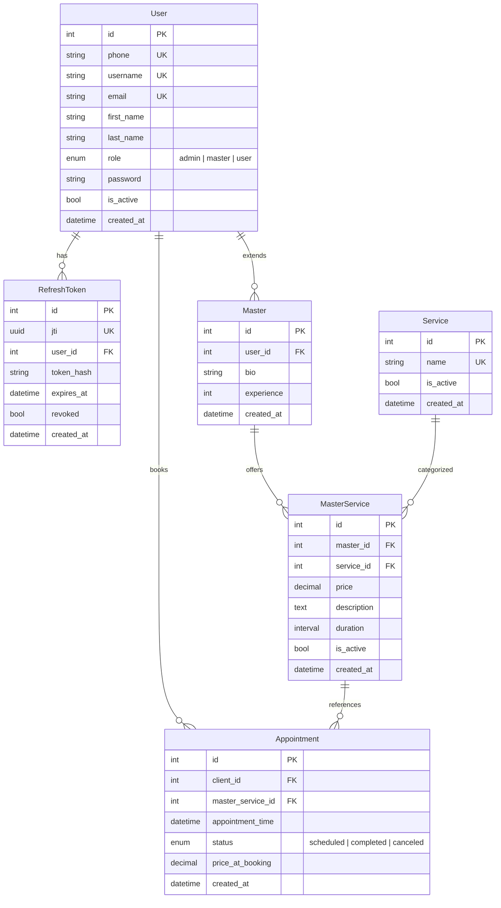

# Beauty Salon API — Система записи в салон красоты

[](https://python.org)
[](https://fastapi.tiangolo.com)
[](https://postgresql.org)
[](https://sqlalchemy.org)
[](https://celeryproject.org)
[](https://redis.io)
[](https://flower.readthedocs.io)
[](https://docker.com)

Асинхронное REST API для салона красоты: управление услугами и мастерами, запись клиентов на приём с JWT-аутентификацией, ролями и email-уведомлениями.

### Возможности

- **Управление услугами и мастерами** — создавай услуги салона, привязывай к мастерам с индивидуальной ценой и длительностью
- **Запись клиентов** — бронирование слота с защитой от пересечений и записи в прошлое
- **Ролевая модель** — три роли (`ADMIN`, `MASTER`, `USER`) с разграничением доступа
- **Email-уведомления** — подтверждение записи + Celery Beat с ежедневными напоминаниями в 05:00 MSK
- **CI/CD** — GitHub Actions: ruff → pytest → Docker → Docker Hub → Render

---

## Технологический стек

| Компонент | Технологии |
|---|---|
| **Язык** | Python 3.14 |
| **Веб-фреймворк** | FastAPI 0.129, Uvicorn 0.41 |
| **База данных** | PostgreSQL 18, SQLAlchemy 2.0 (async), asyncpg, Alembic |
| **Аутентификация** | JWT (python-jose), bcrypt (passlib) |
| **Валидация** | Pydantic 2.12, Pydantic-settings 2.13 |
| **Асинхронная обработка** | Celery 5.6, Celery Beat, Redis |
| **Мониторинг** | Flower 2.0 |
| **Инструменты** | Ruff, pre-commit, Loguru |
| **Тестирование** | Pytest 9.0 (asyncio), HTTPX |
| **Контейнеризация** | Docker, docker-compose |

---

## Структура проекта

```
api-for-beauty-salon2/
├── src/
│   ├── main.py                       # FastAPI app + lifespan (seed users, logging)
│   ├── app/
│   │   ├── api/                      # API слой
│   │   │   ├── endpoints/
│   │   │   │   ├── auth.py           # Логин, логаут, refresh токенов
│   │   │   │   ├── user.py           # Регистрация, профиль, записи пользователя
│   │   │   │   ├── master.py         # Профиль мастера, его услуги и записи
│   │   │   │   ├── service.py        # Услуги салона
│   │   │   │   ├── appointment.py    # Создание записи
│   │   │   │   └── admin.py          # Администрирование (полный CRUD)
│   │   │   ├── dependencies.py       # DI для авторизации
│   │   │   └── routers.py            # Сборка роутеров
│   │   ├── core/                     # Ядро приложения
│   │   │   ├── config.py             # Pydantic-сеттинги из .env
│   │   │   ├── db.py                 # Engine, async session, Base
│   │   │   ├── jwt_services.py       # Создание/верификация JWT
│   │   │   ├── initial_db.py         # Seed первых пользователей
│   │   │   ├── logger.py             # Loguru-логирование
│   │   │   └── types.py              # Кастомные типы
│   │   ├── crud/                     # CRUD-операции
│   │   │   ├── base.py               # Базовый CRUD класс
│   │   │   ├── user.py               # Пользователи
│   │   │   ├── master.py             # Мастера
│   │   │   ├── service.py            # Услуги салона
│   │   │   ├── master_service.py     # Связка мастер-услуга
│   │   │   └── appointment.py        # Записи
│   │   ├── models/                   # SQLAlchemy модели
│   │   │   ├── user.py               # Пользователь
│   │   │   ├── master.py             # Мастер
│   │   │   ├── service.py            # Услуга
│   │   │   ├── master_service.py     # Услуга конкретного мастера
│   │   │   ├── appointment.py        # Запись на приём
│   │   │   └── refresh_token.py      # Refresh-токены
│   │   ├── schemas/                  # Pydantic схемы
│   │   │   ├── user.py               # Регистрация, профиль
│   │   │   ├── master.py             # Мастер
│   │   │   ├── service.py            # Услуги
│   │   │   ├── master_service.py     # Услуги мастера
│   │   │   ├── appointment.py        # Записи
│   │   │   ├── custom_types.py       # Типы с валидацией (телефон, имя, пароль)
│   │   │   └── status_enum.py        # Enum ролей и статусов
│   │   └── services/                 # Бизнес-логика
│   │       ├── base.py               # Базовый сервис
│   │       ├── password.py           # Хеширование паролей
│   │       ├── auth.py               # Аутентификация
│   │       ├── user.py               # Пользователи
│   │       ├── master.py             # Мастера
│   │       ├── master_service.py     # Услуги мастера
│   │       ├── service.py            # Услуги салона
│   │       └── appointment.py        # Записи
│   └── celery_app/                   # Celery
│       ├── worker.py                 # Celery app + autodiscover
│       ├── config.py                 # Beat schedule, queues (default + email)
│       └── tasks/
│           └── send_appointment_reminder.py  # Email-уведомления
├── infra/
│   ├── .env.example                  # Шаблон переменных окружения
│   ├── docker-compose.yml            # Dev-окружение
│   ├── docker-compose.production.yml # Production-окружение
│   └── docker-compose.test.yml       # БД для тестов
├── alembic/                          # Миграции БД
├── tests/
│   ├── unit/                         # Unit-тесты (моки сервисов)
│   └── integration/                  # Интеграционные тесты (реальная БД)
├── Dockerfile
├── requirements.txt
├── ruff.toml
└── pyproject.toml
```

---

## Быстрый старт

### Docker (рекомендуемый способ)

```bash
git clone <url>
cd api-for-beauty-salon2
cp infra/.env.example infra/.env   # отредактировать секреты
docker compose --env-file infra/.env -f infra/docker-compose.yml up --build -d
```

Проверка статуса:

```bash
docker compose --env-file infra/.env -f infra/docker-compose.yml ps
```

### Локальный запуск (без Docker)

Требования: Python 3.14, PostgreSQL 18, Redis.

```bash
pip install -r requirements.txt
cp infra/.env.example infra/.env   # настроить подключение к БД и Redis
alembic upgrade head
uvicorn src.main:app --reload
```

---

## Основные URL

| Сервис | URL |
|---|---|
| Swagger UI (документация API) | http://localhost:8000/docs |
| ReDoc | http://localhost:8000/redoc |
| OpenAPI спецификация | http://localhost:8000/openapi.json |
| Flower (мониторинг Celery) | http://localhost:4444 |
| API |  https://api-for-beauty-salon2.onrender.com/docs |

---

## Переменные окружения

Все runtime-настройки задаются в `infra/.env`. Ниже — ключевые переменные, обязательные для настройки:

| Переменная | По умолчанию | Описание |
|---|---|---|
| `POSTGRES_HOST` / `POSTGRES_PORT` | `localhost` / `5432` | Хост и порт PostgreSQL |
| `POSTGRES_USER` / `POSTGRES_PASSWORD` / `POSTGRES_DB` | `app_user` / `change_me` / `salon` | Учётные данные БД |
| `SECRET` / `SECRET_KEY` / `REFRESH_SECRET_KEY` | — | Секреты для подписи JWT |
| `ACCESS_TOKEN_EXPIRE_MINUTES` | `30` | Время жизни access-токена (мин) |
| `REFRESH_TOKEN_EXPIRE_DAYS` | `7` | Время жизни refresh-токена (дни) |
| `BROKER_URL` | `redis://localhost:6379/0` | Celery broker (Redis) |
| `CELERY_RESULT_BACKEND` | `redis://localhost:6379/1` | Celery result backend |
| `SMTP_HOST` / `SMTP_PORT` | — | Хост и порт SMTP-сервера |
| `SMTP_USER` / `SMTP_PASSWORD` / `SMTP_FROM_EMAIL` | — | Учётные данные email |
| `FIRST_SUPERUSER_PASSWORD` / `FIRST_MASTER_PASSWORD` / `FIRST_USER_PASSWORD` | `change_me` | Пароли seed-пользователей |

Полный список — в `infra/.env.example`.

---

## Модели данных



---

## Система аутентификации

JWT-based (access + refresh токены). **Access-токен** передаётся в заголовке `Authorization: Bearer <token>` (с запасным вариантом через httpOnly cookie). **Refresh-токен** передаётся исключительно через httpOnly cookie.

| Метод | Путь | Описание | Доступ |
|---|---|---|---|
| POST | `/auth/login` | Вход, токены устанавливаются в cookie | Все |
| POST | `/auth/logout` | Выход, отзыв refresh-токена, очистка cookie | Auth |
| POST | `/auth/refresh` | Обновление пары токенов по refresh-токену из cookie | Все |
| POST | `/users/sign_up` | Регистрация нового пользователя | Все |

### Получение токена

```bash
curl -X POST http://localhost:8000/auth/login \
  -H "Content-Type: application/json" \
  -d '{"username": "user", "password": "change_me"}'
```

### Пользователи по умолчанию (seed)

При первом запуске автоматически создаются три пользователя (данные из `infra/.env`):

| Логин | Пароль | Роль | Имя |
|---|---|---|---|
| `admin` | `change_me` | ADMIN | Admin |
| `master` | `change_me` | USER | Master |
| `user` | `change_me` | USER | User |

> Роль `MASTER` присваивается отдельно через администрирование — seed пользователь `master` создаётся с ролью `USER` для последующего назначения.

### Ролевая модель

| Роль | Описание |
|---|---|
| `ADMIN` | Полный CRUD: пользователи, мастера, услуги, записи |
| `MASTER` | Управление своим профилем, своими услугами, своими записями |
| `USER` | Регистрация, управление своими записями |

---

## API Endpoints

### `/masters`

| Метод | Путь | Описание | Доступ |
|---|---|---|---|
| GET | `/masters` | Список всех мастеров | Все |
| GET | `/masters/{master_id}` | Мастер по ID | Все |
| GET | `/masters/{master_id}/services` | Услуги мастера | Все |
| GET | `/masters/{master_id}/services/{id}` | Конкретная услуга мастера | Все |
| GET | `/masters/me` | Мой профиль мастера | MASTER, ADMIN |
| PATCH | `/masters/me` | Обновить свой профиль | MASTER, ADMIN |
| GET | `/masters/me/services` | Мои услуги | MASTER, ADMIN |
| POST | `/masters/me/services` | Добавить себе услугу | MASTER, ADMIN |
| PATCH | `/masters/me/services/{id}` | Изменить свою услугу | MASTER, ADMIN |
| GET | `/masters/me/appointments` | Мои записи | MASTER, ADMIN |
| GET | `/masters/me/appointments/{id}` | Детали записи | MASTER, ADMIN |
| PATCH | `/masters/me/appointments/{id}` | Изменить статус записи | MASTER, ADMIN |

### `/users`

| Метод | Путь | Описание | Доступ |
|---|---|---|---|
| POST | `/users/sign_up` | Регистрация | Все |
| GET | `/users/me` | Профиль текущего пользователя | USER, MASTER, ADMIN |
| PATCH | `/users/me` | Обновить свой профиль | USER, MASTER, ADMIN |
| GET | `/users/me/appointments` | Мои записи | USER, ADMIN |
| GET | `/users/me/appointments/{id}` | Детали записи | USER, ADMIN |
| PATCH | `/users/me/appointments/{id}` | Отменить запись | USER, ADMIN |

### `/services`

| Метод | Путь | Описание | Доступ |
|---|---|---|---|
| GET | `/services` | Список всех услуг салона | Все |
| GET | `/services/{service_id}` | Услуга по ID | Все |

### `/appointments`

| Метод | Путь | Описание | Доступ |
|---|---|---|---|
| POST | `/appointments/{master_service_id}` | Создать запись | USER, ADMIN |

### `/admin`

| Метод | Путь | Описание | Доступ |
|---|---|---|---|
| GET | `/admin/users` | Список пользователей | ADMIN |
| GET | `/admin/users/{user_id}` | Пользователь по ID | ADMIN |
| PATCH | `/admin/users/{user_id}` | Редактировать пользователя | ADMIN |
| GET | `/admin/masters` | Все мастера | ADMIN |
| GET | `/admin/masters/{id}` | Мастер по ID | ADMIN |
| POST | `/admin/masters` | Создать мастера | ADMIN |
| PATCH | `/admin/masters/{id}` | Редактировать мастера | ADMIN |
| POST | `/admin/masters/{mid}/services` | Добавить услугу мастеру | ADMIN |
| GET | `/admin/masters/{mid}/services` | Услуги мастера | ADMIN |
| PATCH | `/admin/masters/{mid}/services/{sid}` | Редактировать услугу мастера | ADMIN |
| GET | `/admin/masters/{mid}/services/{sid}` | Детали услуги мастера | ADMIN |
| POST | `/admin/services` | Создать услугу салона | ADMIN |
| PATCH | `/admin/services/{id}` | Редактировать услугу | ADMIN |
| GET | `/admin/appointments` | Все записи | ADMIN |
| GET | `/admin/appointments/{id}` | Детали записи | ADMIN |
| POST | `/admin/appointments` | Создать запись за пользователя | ADMIN |
| PATCH | `/admin/appointments/{id}` | Редактировать запись | ADMIN |

---

## Примеры запросов

### Список мастеров

```bash
curl http://localhost:8000/masters
```

### Услуги конкретного мастера

```bash
curl http://localhost:8000/masters/1/services
```

### Создание записи

```bash
TOKEN="<access_token>"

curl -X POST http://localhost:8000/appointments/1 \
  -H "Authorization: Bearer $TOKEN" \
  -H "Content-Type: application/json" \
  -d '{"booking_datetime": "2026-06-01T14:00:00"}'
```

### Мои записи (пользователь)

```bash
curl http://localhost:8000/users/me/appointments \
  -H "Authorization: Bearer $TOKEN"
```

### Смена статуса записи (мастер)

```bash
curl -X PATCH http://localhost:8000/masters/me/appointments/1 \
  -H "Authorization: Bearer $TOKEN" \
  -H "Content-Type: application/json" \
  -d '{"status": "completed"}'
```

### Список всех записей (админ)

```bash
curl http://localhost:8000/admin/appointments \
  -H "Authorization: Bearer $TOKEN_ADMIN"
```

---

## Асинхронная обработка (Celery)

**Схема:** API → БД → Celery task (Redis broker) → SMTP

- **Отправка подтверждения** — сразу после создания записи
- **Ежедневные напоминания** — Celery Beat каждый день в 05:00 MSK
- **Очереди:** `default` (общие задачи) + `email` (почтовые)
- **Retry-политика:** до 3 попыток с интервалом 5 минут
- **Мониторинг:** Flower на порту 4444

---

## Разработка

### Линтинг и форматирование

```bash
ruff check .                          # линтинг
ruff check --fix .                    # автоисправления
ruff format .                         # форматирование
```

### Миграции БД

```bash
alembic revision --autogenerate -m "description"  # создать миграцию
alembic upgrade head                                # применить миграции
alembic downgrade -1                                # откатить последнюю
```

### Тестирование

С integration-тестами, которым нужна реальная БД:

```bash
# поднять PostgreSQL для тестов (порт 5433)
docker compose --env-file infra/.env -f infra/docker-compose.test.yml up -d

# запустить тесты
pytest tests/unit/ -v
pytest tests/integration/ -v
pytest tests/ -v

# остановить test-db
docker compose --env-file infra/.env -f infra/docker-compose.test.yml down
```

### Pre-commit

```bash
pre-commit install
pre-commit run --all-files
```

---

## Production деплой

```bash
docker compose --env-file infra/.env -f infra/docker-compose.production.yml up -d
```

GitHub Actions при пуше в `main`:
1. Линтинг (ruff)
2. Тесты (pytest)
3. Сборка Docker-образов и пуш в Docker Hub
4. Триггер деплоя на Render

---

## Лицензия

MIT License

Copyright (c) 2026 Beauty Salon API

Permission is hereby granted, free of charge, to any person obtaining a copy
of this software and associated documentation files (the "Software"), to deal
in the Software without restriction, including without limitation the rights
to use, copy, modify, merge, publish, distribute, sublicense, and/or sell
copies of the Software, and to permit persons to whom the Software is
furnished to do so, subject to the following conditions:

The above copyright notice and this permission notice shall be included in all
copies or substantial portions of the Software.

THE SOFTWARE IS PROVIDED "AS IS", WITHOUT WARRANTY OF ANY KIND, EXPRESS OR
IMPLIED, INCLUDING BUT NOT LIMITED TO THE WARRANTIES OF MERCHANTABILITY,
FITNESS FOR A PARTICULAR PURPOSE AND NONINFRINGEMENT. IN NO EVENT SHALL THE
AUTHORS OR COPYRIGHT HOLDERS BE LIABLE FOR ANY CLAIM, DAMAGES OR OTHER
LIABILITY, WHETHER IN AN ACTION OF CONTRACT, TORT OR OTHERWISE, ARISING FROM,
OUT OF OR IN CONNECTION WITH THE SOFTWARE OR THE USE OR OTHER DEALINGS IN THE
SOFTWARE.

---
